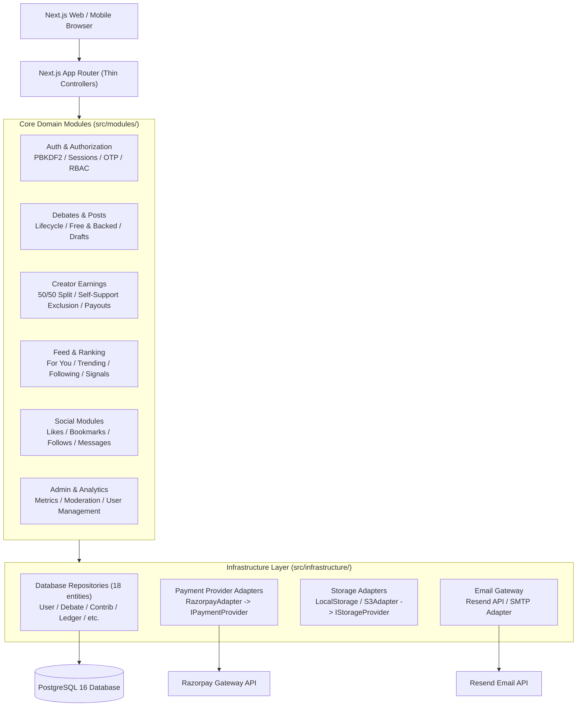
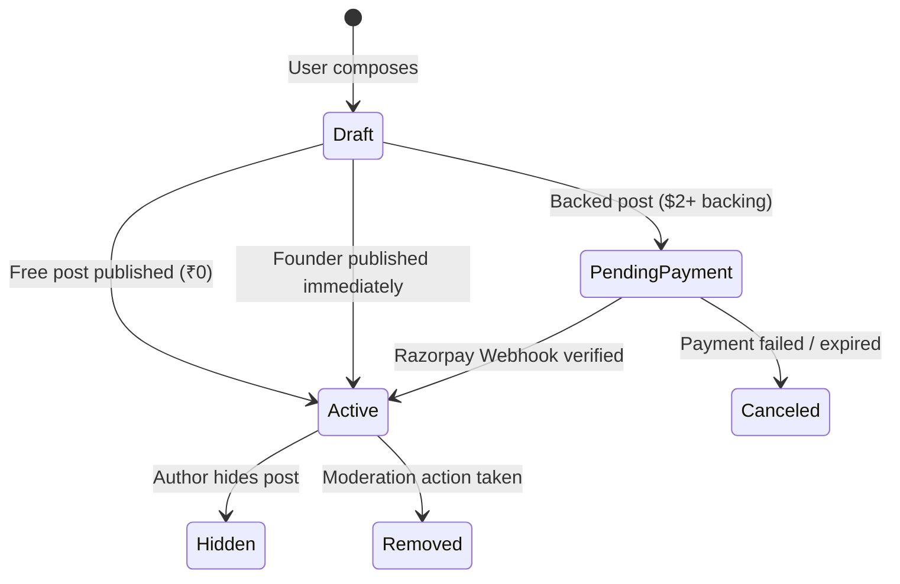

# INDOBID — PRODUCTION SYSTEM ARCHITECTURE SPECIFICATION

**System Name:** IndoBid.lol  
**Document Version:** 2.0.0  
**Architectural Tier:** Production Modular Monolith  
**Runtime:** Next.js 16.3.3 (Turbopack, App Router, React 19, Node.js 20+)  
**Primary Datastore:** PostgreSQL 16 (Render Managed DB)  
**ORM:** Prisma ORM 5.x with Transaction Client Integration  
**Payment Gateway:** Razorpay Standard Checkout & Webhooks  
**Email Gateway:** Resend Transactional Email API  

---

## 1. System Overview

IndoBid is an ideas-and-perspectives discovery and debate platform that fuses public discourse with a creator micro-economy. Users can publish opinions for free (₹0) or attach optional financial backing (minimum $2 USD = 200 paise) to signal conviction. External supporters back perspectives, with 50% of verified contributions rewarded to the opinion author and 50% retained by the platform protocol.

Discussions are ranked through a multi-signal algorithmic engine that dampens monetary dominance ("whale dampening") while rewarding authentic conversation depth, community engagement (likes, bookmarks, views), recency decay, and personal affinity.

---

## 2. Core Architectural Principles

1. **Separation of Concerns:** UI components contain zero business logic; API routes are thin controllers; business logic lives in domain modules; database access is encapsulated in repositories.
2. **Deterministic Financial Accuracy:** All money values are strictly integer paise. Floating-point arithmetic is banned for financial computations.
3. **Double-Spend & Idempotency Protection:** Enforced at the database constraint level via unique indices on `providerPaymentId` and `contributionId`.
4. **Authoritative Server Trust:** Client-supplied role flags, founder overrides, earnings, and scores are strictly ignored. The server authenticates every action.
5. **No Premature Microservices:** Architected as a clean modular monolith that can evolve into distributed services without rewriting core business logic.

---

## 3. High-Level Architecture Diagram



---

## 4. Directory Structure Map

```
indobid.lol/
├── docs/                       # Architecture, Database, Scale, and Operational Docs
├── prisma/
│   ├── schema.prisma           # Authoritative PostgreSQL relational schema
│   └── migrations/             # Versioned SQL migration history
├── src/
│   ├── app/                    # Next.js App Router (Thin HTTP Controllers & Views)
│   │   ├── api/                # API Endpoints (Validate -> Authenticate -> Service)
│   │   └── (routes)/           # Server-side & Client-side UI Pages
│   ├── config/                 # Centralized Configuration & Environment Validation
│   │   ├── env.ts              # Strict Zod schema for process.env
│   │   ├── app.ts              # Application-wide constants & money rules
│   │   └── security.ts         # Security policies, CORS, CSP, Cookie configs
│   ├── infrastructure/         # External Driver Implementations
│   │   ├── database/           # Prisma client, safe transactions, repositories/
│   │   ├── payments/           # RazorpayAdapter, PaymentProvider interface
│   │   ├── storage/            # DatabaseStorage, LocalStorage, S3Storage adapters
│   │   └── email/              # Resend email client & templates
│   ├── modules/                # Self-Contained Domain Modules
│   │   ├── auth/               # Identity, PBKDF2, Sessions, OTP, Authorization
│   │   ├── creator-earnings/   # 50/50 Revenue Split, Payouts, Ledger Engine
│   │   ├── debates/            # Debate CRUD, Publishing, Verification, Policies
│   │   ├── feed/               # For You, Trending, Following, Ranking Signals
│   │   ├── social/             # Likes, Bookmarks, Follows, Direct Messages
│   │   ├── admin/              # Dashboard Metrics, User & Content Moderation
│   │   ├── media/              # Magic-byte inspection & Avatar service
│   │   └── notifications/      # Real-time and audit event notifications
│   └── lib/                    # Backward-Compatible Delegation Gateways & Utilities
└── tests/                      # Full 193-Test Automated Production Test Suite
```

---

## 5. Module Responsibilities

* **`auth/`:** Owns password hashing (PBKDF2), HMAC-SHA256 session token management, 6-digit email OTP generation and cooldown enforcement, password reset token flows, and authoritative role checks (`isFounder`, `isAuthorizedAdmin`).
* **`creator-earnings/`:** Enforces the 50% author share and 50% platform split, executes the 0% self-support exclusion, creates immutable double-entry ledger entries, and manages masked bank/UPI payout routing.
* **`debates/`:** Manages debate creation (both free and backed), sequence #1 author post creation, continuation tracking, topic categories, and author edit permissions.
* **`feed/`:** Encapsulates the recommendation engine, algorithmic signals (engagement, freshness, conversation depth, conviction, affinity), and the author diversity constraint.
* **`social/`:** Manages user follows, likes, bookmarks, and direct message threads.
* **`admin/`:** Aggregates real platform statistics from verified database records, provides content moderation and user suspension controls.

---

## 6. Database Layer & Repositories

Direct database queries are quarantined to `src/infrastructure/database/repositories/`. There are 18 dedicated repositories:
1. `userRepository`
2. `debateRepository`
3. `contributionRepository`
4. `paymentRepository`
5. `ledgerRepository`
6. `categoryRepository`
7. `likeRepository`
8. `bookmarkRepository`
9. `followRepository`
10. `commentRepository`
11. `shareRepository`
12. `notificationRepository`
13. `reportRepository`
14. `messageRepository`
15. `otpRepository`
16. `passwordResetRepository`
17. `payoutAccountRepository`
18. `visitorRepository`

All multi-row mutating flows use `safeDb()` transactions to guarantee ACID guarantees across failures.

---

## 7. Authentication & Authorization

* **User Sessions:** 64-character random session token signed with HMAC-SHA256 using `SESSION_SECRET`. Tokens are transmitted via secure `HttpOnly`, `SameSite=Lax` cookies or `Authorization: Bearer <token>` headers.
* **Founder Identity:** Defined strictly by `ADMIN_EMAIL` (`vishalkumar75912@gmail.com`) and `role === 'founder'`. Client-supplied role attributes are strictly stripped.
* **Admin Authorization:** Verified via `ADMIN_SECRET_KEY` in headers (`x-admin-secret`, `x-admin-key`, or `Authorization: Bearer`) or an authorized Founder session.

---

## 8. Money & Creator Economics

* **Currency:** Native INR settlement backed by Razorpay; UI displays clean USD reference formatting ($2 USD = 200 paise).
* **Minimum Backing:** ₹2 ($2 USD / 200 paise) minimum for paid debates and first paid continuations.
* **Sequential Escalation:** Continuations require at least `lastContributionAmount + 100 paise`.
* **Revenue Split:** 5000 bps (50.00%) to author; 5000 bps (50.00%) to platform.
* **Self-Support Exclusion:** Author backing their own debate receives 0% creator reward; 100% is allocated to platform fee.
* **Idempotent Ledger:** 1 contribution = 1 payment = 1 ledger entry, enforced by `UNIQUE (contribution_id)`.

---

## 9. Debate / Post Lifecycle



---

## 10. Feed & Ranking Engine

* **For You (`for_you`):** Composite ranking combining 30% engagement, 20% conversation, 15% freshness decay, 15% affinity, 10% conviction, and 10% content quality. Applies author diversity spacing (max 2 consecutive items per creator).
* **Trending (`trending`):** Velocity algorithm tracking 24-hour and 7-day contribution volume and unique participant depth.
* **Following (`following`):** Filtered view strictly displaying active debates authored by creators the user follows.

---

## 11. Social Features

* **Likes & Bookmarks:** Free actions with database unique constraints to prevent duplication.
* **Follows:** Subscribes user to creator updates and boosts creator posts in For You feed by +25 points.
* **Direct Messages:** Private threads between two authenticated users with read receipts and participant privacy protection.

---

## 12. Notification System

Asynchronous notification records created upon:
* Perspective replies or continuations on an author's debate.
* User @mentions in post content.
* New follower additions.
* Private direct messages.

---

## 13. Admin Capabilities

* High-level statistical aggregation (debates, verified payments, real revenue, visitor analytics).
* Content moderation: ability to inspect, hide, or remove debates and view report queues.
* User management: account verification, role assignment, and suspension (with Founder account deletion protection).

---

## 14. Moderation System

* Users can submit reports with category reasons (`spam`, `harassment`, `misinformation`).
* Each report imposes a -30 point penalty on the post's ranking score.
* Heavy report volume collapses the composite score to 0, demoting harmful content automatically prior to admin review.

---

## 15. Media Handling

* Profile avatars and media uploads are inspected using **magic-byte header signatures** (PNG, JPEG, GIF, WEBP) to eliminate script injection vulnerabilities.
* Max file size: 2MB.
* Storage is abstracted via `IStorageProvider` (Database, Local Disk, or S3/Cloudflare R2).

---

## 16. Configuration & Environment Variables

All environment variables are validated at server startup via `src/config/env.ts` using Zod. Missing or malformed production variables immediately halt execution with clear diagnostic errors.

---

## 17. Payment Provider Integration

External payment processing is encapsulated in `src/infrastructure/payments/razorpay.adapter.ts`. Domain modules invoke `paymentService.createCheckoutSession` and `paymentService.processSuccessfulPayment` without directly referencing vendor SDKs.

---

## 18. Email Provider Integration

Transactional email dispatch (OTPs, password reset links) is handled via Resend in `src/infrastructure/email/`. Delivery failures are handled gracefully without crashing user registration flows.

---

## 19. Error Handling Architecture

Centralized domain errors (`ValidationError`, `AuthenticationError`, `AuthorizationError`, `NotFoundError`, `ConflictError`, `PaymentError`, `RateLimitError`) map to standard HTTP status codes (400, 401, 403, 404, 409, 402, 429, 500).

---

## 20. Validation Strategy

All HTTP request bodies are validated using Zod schemas at controller entrypoints. Malformed payloads return descriptive HTTP 400 responses before reaching domain services.

---

## 21. Logging & Observability

Structured logging with sanitized output (sensitive tokens, passwords, and raw account numbers are redacted). Real-time visitor heartbeats track live platform activity across 5-minute rolling windows.

---

## 22. Security Architecture

* Password security: PBKDF2 with unique salts.
* Session tokens: HMAC-SHA256 signatures with constant-time equality checks.
* Webhook security: HMAC-SHA256 signature verification.
* Injection defense: Parameterized Prisma SQL queries.
* XSS defense: Magic-byte image inspection and sanitized content rendering.

---

## 23. Scaling Path

Monolith $\rightarrow$ Read Replicas & Redis Caching $\rightarrow$ Background Queue Extraction $\rightarrow$ Selective Microservices (Auth, Feed, Payments). Full blueprint documented in `docs/SCALE-ROADMAP.md`.

---

## 24. Deployment Model

* Deployed as a standalone containerized Next.js Node.js server.
* Managed PostgreSQL database on Render.
* Static assets optimized and cached via edge CDN.

---

## 25. Architecture Decision Records (ADRs)

* **ADR-001: Keep Modular Monolith.** Microservices rejected to avoid distributed transaction overhead on financial ledgers.
* **ADR-002: Integer Money Representation.** Paise chosen over float/decimal to guarantee deterministic arithmetic.
* **ADR-003: Razorpay Adapter Decoupling.** Provider adapter introduced to enable future Stripe or Cashfree migration with zero core code changes.
* **ADR-004: Logarithmic Whale Dampening.** Linear financial ranking rejected in favor of log-compression to prevent pay-to-win dynamics.
* **ADR-005: Dual-Key Admin Header Compatibility.** Admin authorization accepts both `x-admin-secret` and legacy `x-admin-key` for seamless tooling compatibility.
