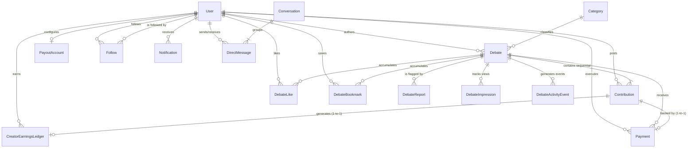

# INDOBID — DATABASE RELATIONSHIPS & ERD DOCUMENTATION

**Document Version:** 2.0.0  
**Status:** Authoritative Entity Relationship Guide  

---

## 1. Entity-Relationship Overview (Mermaid ERD)

---

## 2. Multi-Table Relationships & Cardinality

### 2.1 User & Debate Relationships
* **Cardinality:** 1-to-Many (`User 1 ── * Debate`).
* **Foreign Key:** `debates.authorId` references `users.id` with `ON DELETE SET NULL`.
* **Business Rule:** Anonymously published debates preserve the internal `authorId` relation for moderation and creator reward payout calculations, but API routes sanitize `authorUsername` to `'anonymous'` and set `authorId` to `null` before sending to the client.

### 2.2 Debate & Contribution Sequential Chain
* **Cardinality:** 1-to-Many (`Debate 1 ── * Contribution`).
* **Foreign Key:** `contributions.debateId` references `debates.id` with `ON DELETE CASCADE`.
* **Sequence Invariant:** Sequence #1 is strictly the author's initial thesis/argument. Sequence > 1 are subsequent counter-perspectives, continuations, or paid backings.
* **Integrity Guard:** Contributions are ordered monotonically by `sequence ASC`.

### 2.3 Contribution & Creator Earnings Ledger
* **Cardinality:** Strict 1-to-1 (`Contribution 1 ── 0..1 CreatorEarningsLedger`).
* **Foreign Key:** `creator_earnings_ledgers.contributionId` references `contributions.id` with `ON DELETE RESTRICT`.
* **Integrity Guard:** The database schema enforces `UNIQUE (contributionId)`. One verified contribution can generate at most one ledger entry. Replayed webhooks cannot duplicate earnings records.

### 2.4 Contribution & Payment Records
* **Cardinality:** 1-to-1 / 1-to-Many (`Contribution 1 ── 0..1 Payment`).
* **Foreign Key:** `payments.contributionId` references `contributions.id` with `ON DELETE SET NULL`.
* **Idempotency Guard:** `payments.providerPaymentId` is unique. Multiple payment attempts for a contribution result in distinct payment logs, but only the `status === 'succeeded'` transaction fulfills the contribution.

### 2.5 Social Subscriptions (Follow System)
* **Cardinality:** Many-to-Many Self-Join on Users (`User * ── * User`).
* **Compound Constraint:** `UNIQUE (follower_id, following_id)`.
* **Business Rule:** A user cannot follow the same target twice; double follow triggers a conflict error and is rejected at the database level. Self-following is rejected by application policy.

### 2.6 Organic Engagement (Likes & Bookmarks)
* **`DebateLike`:** `UNIQUE (debate_id, user_id)` ensures exactly 1 like per user per debate.
* **`DebateBookmark`:** `UNIQUE (debate_id, user_id)` ensures idempotent saving.
* **Foreign Keys:** Both reference `debates.id` (`ON DELETE CASCADE`) and `users.id` (`ON DELETE CASCADE`).

### 2.7 Direct Messaging & Conversations
* **`Conversation`:** Contains canonical ordered participant pair `UNIQUE (participant1Id, participant2Id)` where `p1 < p2`.
* **`DirectMessage`:** References `conversations.id` (`ON DELETE CASCADE`), `senderId` (`ON DELETE RESTRICT`), and `recipientId` (`ON DELETE RESTRICT`).

---

## 3. Cascade Deletion Strategies & Risk Matrix

| Entity | Delete Trigger | Action | Orphan Risk Mitigation |
| :--- | :--- | :--- | :--- |
| `Debate` | User Deletion | `SET NULL` | Preserves discussion chain and financial records; author becomes `'anonymous'`. |
| `Contribution` | Debate Deletion | `CASCADE` | Soft-deletion preferred: debates are marked `status = 'removed'` or `'hidden'`. |
| `Payment` | Debate/Contrib Delete | `SET NULL` | Financial audit ledger is never deleted. |
| `CreatorEarningsLedger` | Contrib Delete | `RESTRICT` | Hard database constraint prevents deleting contributions with attached ledger records. |
| `PayoutAccount` | User Delete | `CASCADE` | Masked bank routing removed when user account is purged. |

---

## 4. Referential Integrity Safeguards

1. **Transactional Multi-Row Mutations:** All multi-table operations (payment fulfillment, sequence advancement, ledger recording, and notification creation) execute inside an atomic `prisma.$transaction`.
2. **Double-Spend Exclusion:** The combination of `UNIQUE (providerPaymentId)` on `Payment` and `UNIQUE (contributionId)` on `CreatorEarningsLedger` prevents financial replay attacks at the relational engine level.
3. **Soft-Delete Invariant:** Production debates and accounts use `status: 'hidden'` or `isSuspended: true` rather than SQL `DELETE`, guaranteeing audit permanence for tax, compliance, and dispute resolution.
