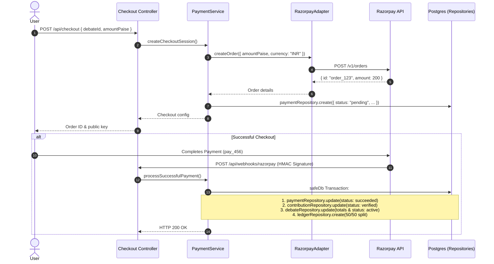

# INDOBID — PAYMENTS, CREATOR ECONOMICS & GATEWAY INTEGRATION SPECIFICATION

**Document Version:** 2.0.0  
**Status:** Authoritative Payment Reference  
**Modules:** `src/modules/payments/`, `src/modules/creator-earnings/`, `src/infrastructure/payments/`  

---

## 1. Monetary Architecture & Rules

All monetary transactions are represented strictly as **integer paise** (`1 INR = 100 paise`, with a `$2 USD = 200 paise` minimum conversion constant) to eliminate IEEE 754 floating-point rounding inaccuracies.

### Locked Business Rules:
1. **$0 Free Opinions:** Users can publish perspectives for ₹0 with zero payment gateway interaction.
2. **$2 Minimum Backing:** Paid debate creation and first paid continuations require a minimum of 200 paise ($2.00 USD).
3. **$1 Continuation Increment:** Each subsequent paid continuation requires at least `lastContributionAmount + 100 paise` ($1.00 USD step-up).
4. **Author Self-Support Exclusion:** When an author contributes to their own debate, the creator reward is strictly **0 paise**. The full 100% is allocated to the platform protocol.
5. **50/50 Creator Revenue Split:** Community backer contributions allocate 5,000 basis points (50.00%) to the author and 5,000 basis points (50.00%) to the platform protocol.

---

## 2. Payment Flow & Lifecycle



---

## 3. Provider Decoupling & Portability

External gateway operations are decoupled behind `IPaymentProvider` (`src/infrastructure/payments/payment.provider.interface.ts`):

```typescript
export interface IPaymentProvider {
  createOrder(params: CreateOrderParams): Promise<PaymentOrder>;
  verifyPaymentSignature(params: VerifySignatureParams): boolean;
  verifyWebhookSignature(params: WebhookSignatureParams): boolean;
  fetchPayment(providerPaymentId: string): Promise<PaymentDetails>;
}
```

The application relies on `razorpayAdapter` implementing this interface. If IndoBid later migrates to Stripe or Cashfree, only a new adapter in `src/infrastructure/payments/` needs to be provided. Business logic in `PaymentService` and `EarningsService` remains 100% unchanged.

---

## 4. Immutable Double-Entry Ledger (`CreatorEarningsLedger`)

Every verified community contribution triggers double-entry ledger attribution inside an ACID database transaction:

* `grossAmountPaise`: Total backing amount in paise.
* `creatorRewardPaise`: `Math.floor((grossAmountPaise * 5000) / 10000)` (0 if self-supported).
* `platformFeePaise`: `grossAmountPaise - creatorRewardPaise`.
* `idempotencyKey`: Deterministic hash (`ledger_${contributionId}`) preventing duplicate attribution on replayed webhooks.

---

## 5. Creator Payouts & Masked Account Security

Creators configure bank account or UPI details via `src/modules/creator-earnings/payout.service.ts`:
* Plaintext account numbers and sensitive credentials are **never stored**.
* Stored strictly masked: `•••• 4821` (bank account), `vi••••@okhdfcbank` (UPI).
* Payout records are protected from public API responses.
