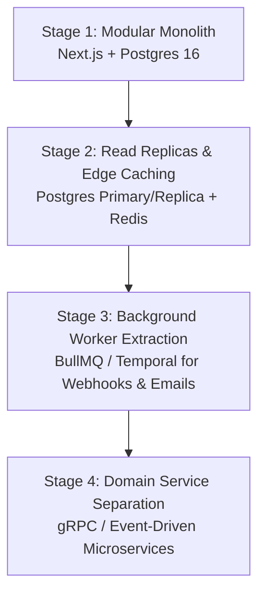

# INDOBID — SCALABILITY ROADMAP & EVOLUTION BLUEPRINT

**Document Version:** 2.0.0  
**Status:** Strategic Architecture Evolution Guide  

---

## 1. Evolution Philosophy: Modular Monolith to Distributed Systems

IndoBid is deliberately engineered as a **Modular Monolith**. 

Microservices introduced prematurely incur devastating distributed system overhead: network latency, distributed transactions, partial failures, split-brain consensus, schema divergence, and astronomical DevOps complexity.

Because IndoBid enforces strict boundaries between domain modules (`src/modules/*`), database repositories (`src/infrastructure/database/repositories/*`), and external adapters (`src/infrastructure/payments/*`, `src/infrastructure/storage/*`), any subsystem can be extracted into an independent microservice later **with zero rewrites of core business logic**.

---

## 2. Scalability Stages

---

### Stage 1: Current Modular Monolith (1 to 100,000 DAU)
* **Architecture:** Unified Next.js application running on Node.js container with single PostgreSQL database instance.
* **Characteristics:**
  * In-process function calls between modules (zero network latency).
  * ACID transactions across debates, contributions, payments, and ledgers.
  * In-memory LRU caching and sliding-window rate limiters.
* **Target Throughput:** Up to 1,500 requests/sec with horizontal web process scaling.

---

### Stage 2: Read Replicas & Caching Layer (100,000 to 1,000,000 DAU)
* **Architecture:**
  * **Database:** PostgreSQL primary (writes) with 2 read replicas (feed queries, profile reads, search).
  * **Cache:** Distributed Redis / Dragonfly cluster for:
    * Precomputed Trending scores and For You candidate IDs.
    * Active visitor counts and session tokens.
    * High-frequency category taxonomy caches.
* **Code Changes Required:** Only `src/infrastructure/database/prisma.ts` needs a replica router extension. Domain modules remain 100% untouched.

---

### Stage 3: Background Worker Extraction (1,000,000 to 5,000,000 DAU)
* **Architecture:** Asynchronous job queues (BullMQ with Redis, or AWS SQS / Temporal).
* **Workloads Extracted:**
  * Payment webhook fulfillment & creator ledger attribution.
  * Resend email OTP dispatch and notifications.
  * Periodic feed ranking score decay recalculation (cron tasks).
* **Code Changes Required:** Wire `paymentService.processSuccessfulPayment` into queue worker consumers. Zero business logic rewriting.

---

### Stage 4: Microservice Separation (5,000,000+ DAU — Only When Justified)
* **Service Boundaries:**
  1. **Auth Service (`src/modules/auth`):** Identity, OTP verification, credential hashing, session tokens.
  2. **Payments & Earnings Service (`src/modules/payments`, `src/modules/creator-earnings`):** Gateway adapters, ledger accounting, bank payouts.
  3. **Feed & Ranking Service (`src/modules/feed`):** Dedicated Python / Go / Rust vector search and real-time composite score computation.
  4. **Core Social Service (`src/modules/debates`, `src/modules/social`):** Discussions, likes, bookmarks, follows.
* **Database Strategy:** Break monolithic PostgreSQL schema into domain databases with transactional outbox pattern and Kafka / RabbitMQ event streaming.

---

## 3. Why NOT to Split Early

1. **Avoid Distributed Transactions:** 2-phase commit (2PC) or Saga patterns across payments and creator ledgers introduce failure modes that do not exist inside a single ACID PostgreSQL database.
2. **Developer Velocity:** Monolithic code navigation allows atomic TypeScript refactoring, end-to-end integration tests, and single-command local deployments.
3. **Infrastructure Cost:** Running 6 microservice clusters with service meshes costs 10x more in cloud hosting fees for negligible early-stage throughput benefits.
